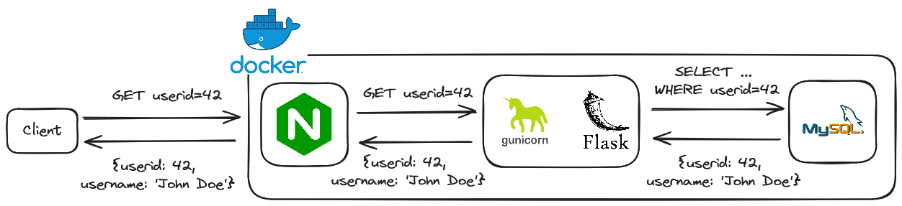

# DevOps Sample Project: Flask - MySQL - NGINX

In order to get a better understanding of Docker and networking, I created a minimal example of an API. The API (Flask) communicates with a database (MySQL) in order to create and fetch users. In order to call the API one has to send requests to a reverse proxy (NGINX) which will then forward the requests to Flask via a GUnicorn WSGI server. The whole infrastructure is containerized and works with docker compose.

## Architecture

The chosen components for this use case are more or less standard, though I tried to keep them as close to a real world example as possible. A short list of explanations:

- Docker Compose: Industry standard for small scale container orchestration. A more ambitious choise would be a Kubernetes cluster, but I wanted the keep the scale of the example concise.
- NGINX: Highly efficient web server used as an example for a reverse proxy / API gateway.
- GUnicorn: A popular WSGI server to make python applications accessible via web servers like NGINX. Also, it's recommended by Flask for Production use.
- Flask: A python framework to write web applications / APIs. A notable alternative would be FastAPI. I chose Flask since I had not worked with it before and it seemed the most lightweight solution.
- MySQL: A standard OLTP database for use in web applications. Possible alternatives would be Postgres or MariaDB.

## Prerequisites

You can find a list of prerequisites as well as the version I used to implement this project:

- Docker Compose version v2.22.0-desktop.2
- Docker version 24.0.6, build ed223bc

## How to Run This Project

1. Start the docker containers using Docker Compose: `docker compose --build up`
2. Verify that all containers are running correctly: `docker ps`
3. Create a user via the `create_user` API endpoint: `curl -X POST "localhost:80/create_user?userid=1&username=John"`
4. Query user information via the `get_user` API endpoint: `curl "localhost:80/get_user?userid=1"`
5. Shut down docker containers using `docker compose down`

## Lessons Learned

Below you can find a list of insights I gained while working on this project:

- What is a reverse proxy and why should you use one?
- What is a WSGI server and why do you need it?
- How to write a small API using Flask and python
- How to use SQLAlchemy to communicate between Flask and a database
- How to troubleshoot networking issues in Docker Compose
- How to use secrets in Docker Compose

Possible extensions include:
- Replace Docker Compose by Kubernetes (e.g. minikube for local development)
- Include some kind of CI/CD process, e.g. automatically test the python code and build and push the docker images to Docker Hub
- Include a simple monitoring using Graphana, e.g. How many API calls per second
